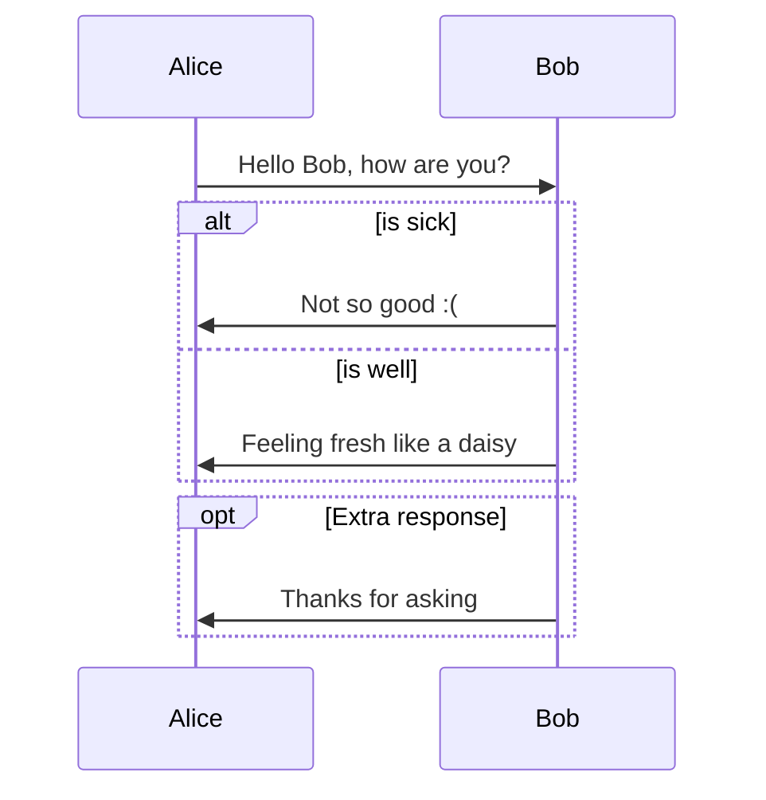

# sato.github.io

Welcome to my testing and tooling environment !

# Markdown possibilities listing

- Headers
- Emphasis
- Lists
- Links
- Images
- Code and Syntax Highlighting
- Tables
- Blockquotes
- Inline HTML
- Horizontal Rule
- Line Breaks
- YouTube Videos 

# Test Mermaid graphs

For source go see this link : [Markdown Cheatsheet](https://github.com/adam-p/markdown-here/wiki/Markdown-Cheatsheet#links)
